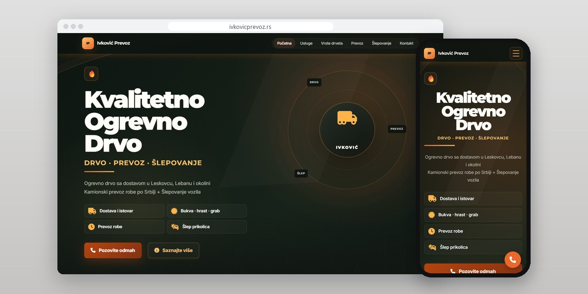
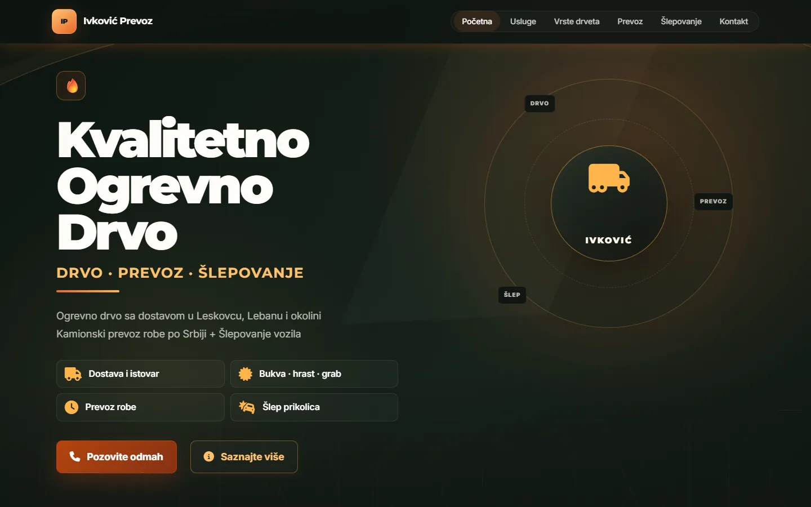
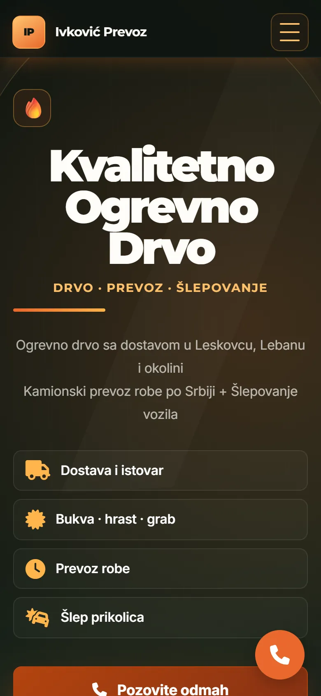
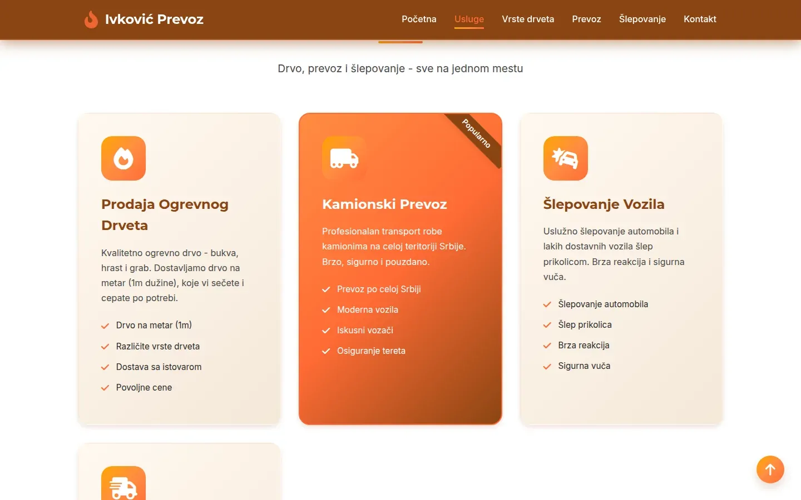
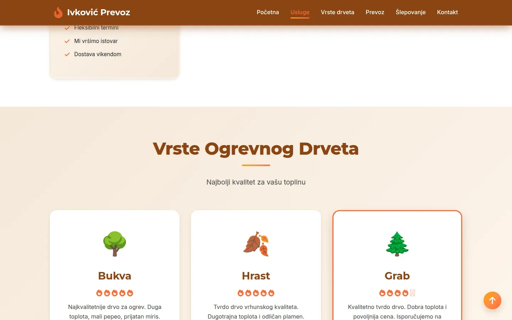

# Ivković Prevoz

One-page site for a Leskovac firm that sells firewood, hauls freight and tows vehicles, with ten call links and no contact form.

**[ivkovicprevoz.rs](https://ivkovicprevoz.rs/)** · [Case study (in Serbian)](https://svilenkovic.com/radovi/ivkovic-prevoz) · [Srpski](README.sr.md)

> [!NOTE]
> Client project. The source code belongs to the client and stays in a private repository. This page describes what I built and how.

<table>
  <tr><td><b>Client</b></td><td>Ivković Prevoz</td></tr>
  <tr><td><b>Industry</b></td><td>Firewood, truck freight and vehicle towing</td></tr>
  <tr><td><b>Location</b></td><td>Leskovac, Serbia</td></tr>
  <tr><td><b>Type</b></td><td>One-page website</td></tr>
  <tr><td><b>My role</b></td><td>Design, development, SEO, hosting and maintenance</td></tr>
  <tr><td><b>Stack</b></td><td>PHP 8.3, nginx, JSON-LD, Consent Mode v2</td></tr>
</table>

## About the project

Ivković Prevoz from Leskovac does three unrelated jobs. It sells beech, oak and hornbeam firewood by the metre with delivery and unloading, hauls freight by truck anywhere in Serbia, and tows vehicles around Leskovac, Lebane and the towns nearby. People search for each service with different words and in a different season, and all three are arranged over the phone.

So I built the page without a contact form or a single input field. There are ten places to call from instead, and on phones a bar with the number stays at the bottom of the screen. Someone whose car broke down on the road will not wait for an email reply. There are no photos either: the background of the first screen is a vector illustration written into the CSS, so the page opens fast on a weak mobile signal.

## What I built

- Three full service sections, and a contact box that gives the service area separately for firewood, freight and towing
- A towing section split by situation (a breakdown on the road, a car bought in another town, vans), because people search for it in several ways
- Ten call links and a call bar on phones; with no form, spam bots have nothing to fill in
- Fonts and icons served from the site's own domain, and an nginx page cache that falls back to the last good copy if PHP fails
- Seven JSON-LD blocks, with towing described as a separate service covering five towns
- A fix for cards that stayed invisible on phones after a jump from the menu: the reveal threshold is now zero and anything already scrolled past is shown

## Results

| | Performance | Accessibility | Best practices | SEO |
| :-- | :-: | :-: | :-: | :-: |
| Mobile | 91 | 100 | 100 | 100 |
| Desktop | 99 | 100 | 100 | 100 |

PageSpeed Insights, lab test of the live site, September 2026. Security headers: 6 of 6. HTML validator: no errors. axe accessibility check: no violations. Structured data: `LocalBusiness`.

## Screenshots

<table>
  <tr>
    <td width="68%" valign="top"></td>
    <td width="32%" valign="top"></td>
  </tr>
</table>

Services: firewood sales, truck transport and vehicle towing

Types of firewood: beech, oak and hornbeam, each with its own description

---

Built by [D. Svilenković](https://svilenkovic.com).
